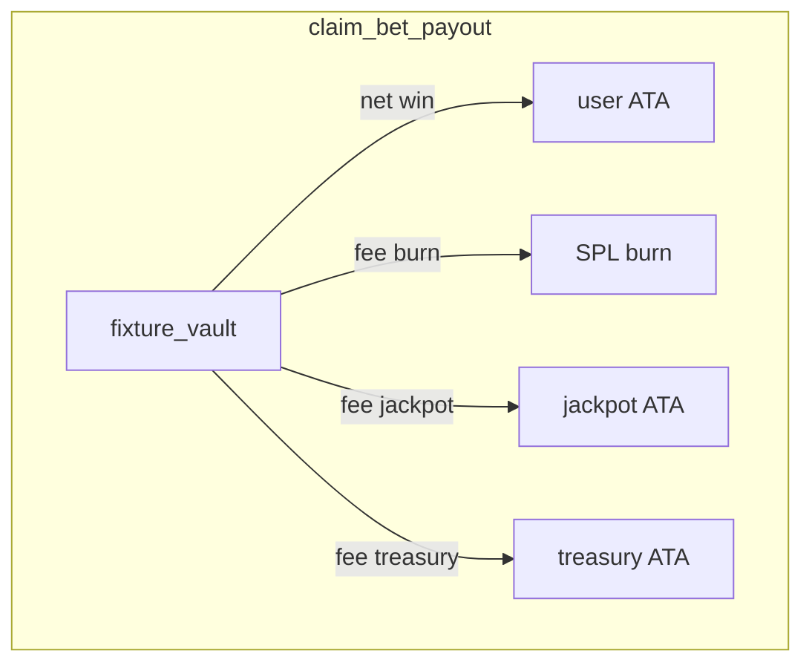

# P1 Design: On-Chain Sinks & Emission Guards

**Status:** Implemented in on-chain core (`goalworld_program/.../lib.rs`) with follow-up operational hardening pending  
**Depends on:** P0 (oracle %, potion 100 GCH, `initial_base_yield`)  
**Program ID:** `FbDhM4itBS2Cco7c7PbNvC98Fx7Y5HxqXS1JuXdNcBwg`

---

## 1. Goals (historical design reference)

1. Convert betting house edge into **deflation** (burn) and **engagement** (jackpot), not only treasury accumulation.
2. Implement **match stamina drain** so potion demand matches `DYNAMIC_YIELD_ORACLE.md`.
3. Cap **Starting XI** salary claims per manager per day.
4. Align **rent** with documented 70/30 + protocol fee.

Target: **emit/burn ratio 0.85–1.05** at 1k–10k DAU (see `TOKENOMICS_EQUILIBRIUM.md`).

---

## 2. GlobalConfig extensions

```rust
pub struct GlobalConfig {
    // ... existing ...
    pub fee_burn_bps: u16,      // share of claim fee burned (e.g. 400 = 40% of fee)
    pub fee_jackpot_bps: u16,   // share to jackpot PDA (e.g. 400)
    // remainder → treasury (1000 - burn - jackpot)
    pub max_starters_per_manager: u8, // default 11
}
```

**Validation:** `fee_burn_bps + fee_jackpot_bps <= fee_bps`.

**Default proposal:** `fee_bps = 1000`, `fee_burn_bps = 400`, `fee_jackpot_bps = 400`, treasury gets 200 bps of the 1000 fee slice (20% of fee amount).

---

## 3. Instruction: `claim_bet_payout` / `claim_market_payout` fee split

### Current

```
user_fee = gross × fee_bps / 10000  → 100% treasury
```

### Proposed

```
user_fee = gross × fee_bps / 10000
burn_part = user_fee × fee_burn_bps / fee_bps
jackpot_part = user_fee × fee_jackpot_bps / fee_bps
treasury_part = user_fee - burn_part - jackpot_part
```

### Accounts (add)

- `jackpot_token_account: InterfaceAccount<TokenAccount>` — PDA `["jackpot", token_mint]`
- Existing `treasury_token_account`

### CPI order

1. Transfer net winnings to user (unchanged).
2. `burn(jackpot_part)` from vault authority **or** transfer to burn address — prefer SPL `burn` from vault if policy is vault-funded; **recommended:** burn from `user_fee` portion transferred to a burn escrow owned by config, then `burn`.
3. Transfer `jackpot_part` to jackpot ATA.
4. Transfer `treasury_part` to treasury.

**Simpler MVP:** Burn and jackpot taken from `user_fee` after transfer from vault: split `user_fee` into three `transfer_checked` destinations (burn uses `token::burn` on a dedicated burn ATA funded in same ix).

### Simulation impact (H1)

At 1M GCH daily bet volume, 10% effective fee, 40% burn → **~20k GCH/day burned**.

---

## 4. Instruction: `oracle_record_match`

**Authority:** `oracle_authority` only.

```rust
pub fn oracle_record_match(
    ctx: Context<OracleRecordMatch>,
    fixture_id: String,
    stamina_cost: u8,  // default 30, max 50
) -> Result<()>
```

**Effects:**

- `player.current_stamina = player.current_stamina.saturating_sub(stamina_cost)`
- `player.matches_played += 1`
- Optional: set `last_match_result` for future momentum (off-chain index first)

**Idempotency:** Store `last_match_fixture: Option<String>` on `ParodyPlayer`; reject duplicate `fixture_id`.

**Error:** `InsufficientStamina` does not block record — manager may still record truth; claim blocked separately.

---

## 5. Instruction: `claim_daily_salary` — XI cap

### State (new PDA per manager)

```rust
#[account]
pub struct ManagerDailyClaim {
    pub manager: Pubkey,
    pub day_bucket: i64,  // unix / 86400
    pub claims_count: u8,
    pub bump: u8,
}
```

**Seeds:** `["manager_claims", manager.key(), day_bucket.to_le_bytes()]`

**Check:**

```rust
require!(claims_count < config.max_starters_per_manager, TooManyStarterClaims);
claims_count += 1;
```

**Client:** Pass `manager_state` owner as signer; only listed XI mints in remaining accounts (optional strict: remaining accounts meta).

**Emission impact (H8):** Max per manager ≈ **11 × avg_base** instead of full collection.

---

## 6. Rent split: `rent_nft` v2

### Current

100% `price_per_match` → owner.

### Proposed

```
protocol_fee = price × 500 / 10000   // 5%
owner_share  = price × 2500 / 10000  // 25%
renter_rebate = price - protocol_fee - owner_share  // 70% — paid as yield boost or instant transfer to renter wallet if rent-to-earn
```

**MVP without renter wallet on chain:**  
- 70% → `renter_escrow` ATA (borrower must claim)  
- 25% → owner  
- 5% → split burn/jackpot like fees  

**Golden recall:** unchanged (50% penalty to borrower).

---

## 7. Account diagram



---

## 8. Errors (new)

| Code | When |
|------|------|
| `TooManyStarterClaims` | XI cap exceeded |
| `DuplicateMatchRecord` | Same fixture_id twice |
| `InvalidFeeSplit` | burn + jackpot &gt; fee_bps |

---

## 9. Test plan

1. Fee split: pool 1000 GCH, winner claims → assert burn + jackpot + treasury lamports.
2. `oracle_record_match`: stamina 100 → 70; claim with stamina &lt; 5 fails.
3. XI cap: 12th claim same day fails.
4. Rent: 200 GCH rent → owner 50, protocol 10, renter escrow 140.

---

## 10. Migration / rollout

1. Deploy new `GlobalConfig` fields via `update_config` (admin) — **fields exist in program**; validate on target cluster.
2. Initialize jackpot ATA PDAs.
3. Oracle upgrade: call `oracle_record_match` after each fixture resolution — **ix implemented; oracle call pending**.
4. Frontend: show fee split in i18n (replace “10% burned” unless burn_bps > 0).

---

## 11. Issue tracking

See [`docs/issues/P1-onchain-sinks.md`](issues/P1-onchain-sinks.md).
