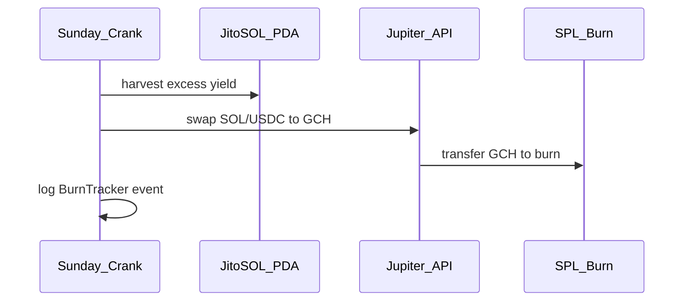

# P2 Roadmap: Vault Buyback, Mint Gate & Supply Policy

**Status:** Technical roadmap (off-chain + future program instructions)  
**Related:** [`ai_context/02_economy/VAULT_TECH_ROADMAP.md`](../ai_context/02_economy/VAULT_TECH_ROADMAP.md), [`TOKENOMICS_EQUILIBRIUM.md`](TOKENOMICS_EQUILIBRIUM.md)

---

## 1. Objectives

1. **Revoke or constrain mint authority** after TGE so emission is predictable.
2. **Automate buyback + burn** from JitoSOL/mSOL vault yield.
3. **Mint gate** tied to measured emit/burn ratio (infinity supply with discipline).
4. **Enforce Builder Fund policy**: the 10% development fund finances contributors, APIs/models, and marketing from a single auditable budget.

---

## 2. Phase A — Pre-mainnet (operational)

| Step | Action                                                                     | Owner    |
| ---- | -------------------------------------------------------------------------- | -------- |
| A1   | Mint **1B GCH** once to `salary_vault` + operational reserve               | Multisig |
| A2   | Document public **circulating supply** API (Helius + vault balances)       | Backend  |
| A3   | **Revoke mint authority** on SPL mint (irreversible)                       | Multisig |
| A4   | Fund vault with genesis SOL → JitoSOL per `contribute_presale` / NFT sales | Treasury |

**Policy choice (product):**

- **Cap 1B:** All salaries paid from pre-funded vault; no mint.
- **Infinite with gate:** Retain mint authority on multisig; gate script only (Phase B).

---

## 3. Phase B — Mint gate (off-chain crank)

### Metrics (daily cron)

```
emission_7d  = sum(salary_claims) + sum(architect_tax)
burn_7d      = sum(feed_potion) + sum(fee_burns) + sum(vault_buyback_burns)
ratio        = burn_7d / emission_7d
```

### Rules

| ratio       | Action                                                           |
| ----------- | ---------------------------------------------------------------- |
| 0.85 – 1.05 | Normal: refill vault if balance &lt; 14 days runway              |
| &lt; 0.85   | **Pause** `mintTo` 48h; promote potion/events                    |
| &gt; 1.20   | Allow small mint for onboarding OR jackpot subsidy from treasury |
| &gt; 10     | Emergency: investigate oracle bug or exploit                     |

### Runbook script (proposed path)

`goalworld_oracle/scripts/mint_gate.ts`:

- Read vault ATA balance, 7d indexer totals
- Output `{ allow: boolean, max_mint: u64, reason: string }`
- Require 2-of-3 multisig signature for any mint

---

## 4. Phase C — Vault crank (buyback & burn)

### Architecture



### Steps (weekly 00:00 UTC)

1. **Harvest** — Compare JitoSOL balance to principal ledger; `excess = balance - principal`.
2. **Swap** — Jupiter v6: `excess_sol → GCH` with slippage cap 1%.
3. **Burn** — `spl-token burn` or send to `11111111111111111111111111111111` ATA.
4. **Publish** — Update `BurnTracker` on docs + optional on-chain counter account.

### Parameters

| Param                    | Default               |
| ------------------------ | --------------------- |
| `BUYBACK_SHARE_OF_YIELD` | 60%                   |
| `JACKPOT_SHARE`          | 10% of yield          |
| `REINVEST_SHARE`         | 30% (stay in JitoSOL) |
| Min crank                | 0.1 SOL excess        |

### Treasury size (H7)

| SOL in vault | APY  | GCH @ $0.01 buyback/day |
| ------------ | ---- | ----------------------- |
| 1,000        | 7.5% | ~15k                    |
| 5,000        | 7.5% | ~77k                    |
| 10,000       | 7.5% | ~154k                   |

**Recommendation:** ≥ **5,000 SOL** equivalent before scaling past ~1k daily active managers.

---

## 5. Phase D — On-chain optional upgrades

| Instruction             | Purpose                                           |
| ----------------------- | ------------------------------------------------- |
| `vault_deposit_sol`     | NFT sale → Jito CPI (extend `contribute_presale`) |
| `vault_harvest_buyback` | Permissionless crank with slippage bounds         |
| `record_burn_volume`    | Single global `total_burned` u64 for transparency |

Hyre/Phi agent logic remains **off-chain** (see `treasury_agents_test.ts` mocks); do not block P2 on perps.

---

## 6. Post-TGE checklist

- [ ] Mint authority revoked or gated
- [ ] LP tokens burned (anti-rug)
- [ ] Salary vault runway ≥ 90 days at modeled emit
- [ ] Crank monitored (PagerDuty / Discord)
- [ ] Public dashboard: emit, burn, ratio, vault SOL

---

## 7. Issue tracking

See [`docs/issues/P2-vault-mint.md`](issues/P2-vault-mint.md).

## 8. Builder Fund budget integration (policy update)

- Use one Builder Fund wallet/PDA for all development spending buckets.
- Track sub-ledger categories:
  - contributor rewards,
  - API/model/infra spend,
  - marketing/growth spend.
- Publish monthly statement: inflows, outflows, runway, and category share.

### Implemented on-chain (current state)

- `BuilderFund` account with unified 10% policy and auditable sub-ledgers (`contributors`, `api_infra`, `marketing`).
- Contributor scoring registry (`ContributorScore`) with admin-governed upsert.
- Epoch-based distribution flow:
  - `start_contributor_epoch`
  - `register_contributor_epoch_snapshot`
  - `finalize_contributor_epoch`
  - `claim_contributor_epoch`
- Snapshot-based claims avoid retroactive reward changes when live scores are later edited.
- Anti-sybil guardrails on-chain:
  - score update cooldown,
  - minimum score threshold per epoch,
  - max contributors per epoch.
- Oracle hook script added: `goalworld_oracle/src/contributor_epoch_hook.ts` (`npm run contributor-epoch-hook`), mapping git contributors to wallet addresses via `contributor_wallet_map.json`.

---

## 9. Week-5 policy decision (locked)

**Decision:** `infinite gated` with multisig control (not fixed 1B hard-cap at this stage).

### Why

- Keeps emissions flexible for live ops while preserving control through gate rules.
- Matches current on-chain architecture where salaries are operationally funded and policy-enforced.
- Avoids premature supply lock while still requiring explicit governance for mint actions.

### Guardrails (mandatory)

- 2-of-3 multisig required for mint execution.
- `mint_gate` decision must be attached to each mint operation (`goalworld_oracle/src/mint_gate.ts`).
- Pause mint automatically when `burn_7d / emit_7d < 0.85`.
- Weekly publication of `emit_7d`, `burn_7d`, `ratio`, and action taken.

### Revisit trigger

- Revisit this decision after 30 days of stable production telemetry
  or when DAU exceeds 10k managers.
