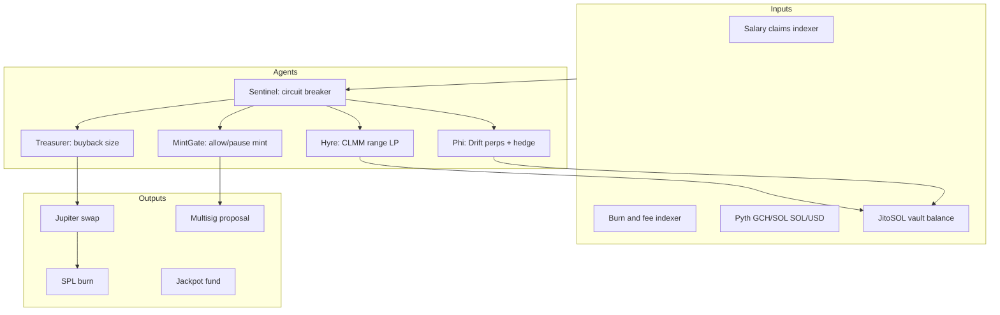

# Vault Administration & Agentic AI Strategies

**Related:** [`P2_VAULT_MINT_ROADMAP.md`](P2_VAULT_MINT_ROADMAP.md), [`TOKENOMICS_EQUILIBRIUM.md`](TOKENOMICS_EQUILIBRIUM.md)  
**Simulation:** `python3 scripts/tokenomics_simulation.py` → [`docs/data/tokenomics_vault_agentic.csv`](data/tokenomics_vault_agentic.csv)

---

## 1. Administration modes (comparison)

| Mode | ID | Treasury SOL | Buyback/day @ $0.01 | vs catalog emit (153k) | Complexity |
|------|-----|--------------|----------------------|-------------------------|------------|
| Manual multisig | `V_manual` | 2,000 | ~9.8k GCH | Deficit | Low |
| Deterministic crank | `V_crank` | 5,000 | ~18.5k GCH | Deficit | Medium |
| Hyre + Phi split | `V_hyre_phi` | 5,000 | ~24.8k GCH | Deficit | High |
| Sentinel agent | `V_agentic_sentinel` | 8,000 | ~41.6k GCH | Deficit | High |
| Full orchestrator | `V_agentic_orchestrator` | 12,000 | ~74.2k GCH | ~49% covered | Very high |

*Figures from `vault_admin_simulations()`; regenerate CSV after parameter changes.*

At **$0.01/GCH**, even the orchestrator mode needs **combined sinks** (potion + fee burn ~40–80k/day) to balance competitive player-base emission (~6M/day for 2k users).

---

## 2. Player base profiles (simulation IDs)

| Profile | Users | Avg base GCH | Net pressure (indicative) |
|---------|-------|--------------|---------------------------|
| `PB_casual` | 5,000 | 100 | Inflationary |
| `PB_competitive` | 2,000 | 290 | Inflationary |
| `PB_whale` | 200 | 2,500 | High emit, high potion burn |
| `PB_catalog_max` | 528 | ~26.4 | Deflationary if potions adopted |
| `PB_onboarding` | 20,000 | 50 | Mass inflation without sinks |

**Design implication:** Onboarding waves need **fee burn + XI cap** before scaling MAU.

---

## 3. Risk profiles (protocol policy)

| Profile | Mint mult | Fee burn share | Vault buyback share | Target emit/burn |
|---------|-----------|----------------|---------------------|------------------|
| `RP_conservative` | 0.5× | 50% | 70% | 0.95 |
| `RP_balanced` | 1.0× | 40% | 60% | 1.00 |
| `RP_aggressive` | 1.5× | 20% | 40% | 1.15 |
| `RP_degen` | 3.0× | 0% | 20% | 1.50 |

Cross with `PB_competitive` in CSV category `risk_profile`.

**Recommended mainnet default:** `RP_balanced` + `V_crank`, graduate to `V_agentic_sentinel` after 90 days of metrics.

### Builder Fund financing rule

El 10% del **Builder Fund** también cubre costos de APIs/modelos/infra para desarrollo y marketing.  
La operación de agentes debe tratar ese 10% como un presupuesto unificado de construcción, no como un gasto separado.

---

## 4. Agentic architecture (general-purpose orchestrator)



### 4.1 Sentinel (circuit breaker)

**Reference:** [`goalworld_program/tests/treasury_agents_test.ts`](../goalworld_program/tests/treasury_agents_test.ts)

| Signal | Action |
|--------|--------|
| Vault drawdown &gt; 5% / 24h | Pause Phi leverage |
| `emit/burn` &lt; 0.7 for 7d | Pause mint; increase buyback share +10% |
| GCH price −20% / 24h | Tighten CLMM range; reduce long GCH leverage |
| Oracle anomaly | Halt automated txs; alert humans |

### 4.2 Hyre agent (liquidity)

- Monitors Raydium/Orca CLMM around GCH/SOL.
- On **supply shock** (potion burn spike, WC match day): tighten range to capture fees; avoid IL during volatility.
- Harvest fees → forward to Treasurer for buyback budget.

### 4.3 Phi agent (perps & hedge)

- **Long GCH/SOL** when Sentinel flags deflationary week (support price).
- **Short SOL/USD** on FlashTrade when macro risk (protect USD value of vault).
- Net PnL → buyback; losses trigger Sentinel pause.

### 4.4 Treasurer agent (buyback execution)

Weekly policy:

```
budget_usd = vault_yield_usd × buyback_share - agent_overhead
gch_amount = jupiter_quote(budget_usd, slippage_bps=100)
if emit_burn_7d < 0.85: budget_usd *= 1.2
execute_burn(gch_amount)
```

### 4.5 MintGate agent (supply)

- Reads `scripts/mint_gate.ts` (to implement per P2).
- Outputs `{ allow, max_mint, reason }` for multisig.
- **Never** auto-mint without human/multisig signature in v1.

---

## 5. Advanced options matrix

| Option | Pros | Cons | When to use |
|--------|------|------|-------------|
| Manual only | Simple, auditable | Slow; emotional delay | Pre-launch &lt; $500k vault |
| Cron crank | Predictable burn | No market timing | Steady state |
| Hyre+Phi fixed split | Yield + hedge | Ops complexity | $5M+ vault |
| Sentinel + agents | Adapts to emit/burn | Needs monitoring & audits | Post-PMF |
| Full orchestrator + LLM planner | Holistic policy | Highest risk; governance | Only with DAO approval |

**LLM orchestrator (optional layer):** A general agent (e.g. Cursor automation / custom worker) consumes:

- `tokenomics_scenarios.csv` weekly
- On-chain emit/burn dashboards
- Pyth prices

It proposes **parameter updates** (`fee_bps`, `fee_burn_bps`, buyback_share) as **multisig transactions**, not direct execution. Human or 2-of-3 approves.

---

## 6. Equilibrium combo (reference)

From CSV `EQ_competitive_balanced_crank`:

- **Emission:** ~6M GCH/day (2k competitive users)
- **Sinks:** potion + 40% fee burn + crank buyback (~18.5k) → still inflationary without P1 XI cap

**Conclusion:** Agentic vault **alone** does not balance competitive growth; **P1 sinks + XI cap** are required in parallel.

---

## 7. Implementation checklist

- [ ] Indexer: daily `emission_gross`, `potion_burn`, `fee_burn`, `vault_burn`
- [ ] Deploy Sentinel thresholds in config JSON
- [ ] Wire Hyre/Phi mocks → production adapters (Jupiter, Drift APIs)
- [ ] `goalworld_oracle/scripts/mint_gate.ts` + MintGate agent read path
- [ ] Weekly cron: `tokenomics_simulation.py` → Slack summary
- [ ] DAO vote template for risk profile changes (`RP_*`)

---

## 8. Regenerate data

```bash
python3 scripts/tokenomics_simulation.py
# docs/data/tokenomics_scenarios.csv      — full grid
# docs/data/tokenomics_vault_agentic.csv  — vault & equilibrium only
```
