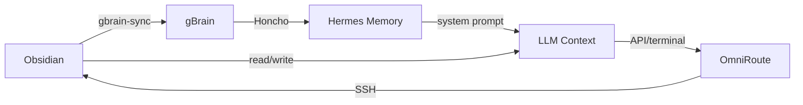

# Memory & Context Architecture

## 1. Systems Overview
| System | Location | Key Access Tool | Sync Mechanism |
|--------------|-----------------------------------|-------------------------------|--------------------------|
| **Obsidian** | `/data/apps/GoalWorld/ai_context/`| `read_file()`/`write_file()` | `gbrain-sync` daemon |
| **gBrain**   | `/data/apps/GoalWorld/ai_context/`| `gbrain query`                | `gbrain import`          |
| **Honcho**   | Honcho backend (API)             | `honcho_search()`             | Auto (conversation flow) |
| **Hermes**   | `/data/hermes-home/memory/`       | `memory()`                    | Manual edit              |

## 2. OmniRoute Configuration
- **Endpoint**: `100.101.211.44:20128`
- **Token**: `sk-cac9fb818e70e6bb-f4dcba-60525661`
- **Combos**:
  - `coding-best`: NV + KC (moonshot/kimi, nemotron-3-ultra)
  - `coding-fast`: 10x NV > KC (qwen3-coder) > OR fallback
  - `deep-reasoning`: Grok 4.3 + nemotron-3-ultra

## 3. Critical Workflows
### 3.1 Startup Credits
- **Tracker**: `/docs/intake/startup-credits/master-tracker.md`
- **Blockers**:
  - **Legal entity** (P0 for Google/MS/AWS/NVIDIA)
  - **LinkedIn** (Blocker #2)

### 3.2 OmniRoute Management
1. **SSH Access**: `ubuntu@100.101.211.44`
2. **Update Script**: `run_remote_python` for `storage.sqlite`
3. **Resilience**: `PATCH /api/resilience`

## 4. Anti-Noise Rules
- ❌ **Never store**: Logs, temporal states, duplicated configs.
- ✅ **Always link**: Use `[[wikilinks]]` in Obsidian for cross-references (ej: `[[Startup Credits]]`).