# LangGraph — Empresa autónoma de agentes goalworld

- **Task Created:** https://github.com/TheNeuralWars/goalworld/issues/264
- **Task Status:** ready

**Status:** `ready` (Fase 0 scaffold en repo; VPS deploy pendiente Antigravity)  
**Owner:** Nico (CEO) · **Implementación VPS:** Antigravity  
**Vértice:** V7 Ops / agentes (complementa Hermes, no lo reemplaza)

---

## Objetivo

Servicio Python **aislado** (`goalworld-multiagent`) con **LangGraph** como cerebro de routing cíclico (CEO → Dev / Growth / Ops → CEO → …). **Hermes** sigue siendo front-desk (Discord, WhatsApp, `prioridad` | `dispatch` | `estado`); llama al grafo vía **HTTP local** (`127.0.0.1`).

No instalar LangGraph dentro del runtime OpenClaw/Hermes.

---

## Principios (Mundial 2026)

| Regla | Motivo |
|-------|--------|
| Servicio aparte en VPS | No romper `~/.hermes` ni `oa-worker` |
| Sin writes a repo en Fase 1 | Dev delega a **FCC** (`agent:opencode`) vía GitHub, no edita `~/hermes/workspace` directo |
| Sin mainnet / treasury / mint | Alineado con `AGENT_DIRECTIVES.md` y scope freeze hasta 2026-06-11 |
| Toda acción irreversible → issue + brief | Misma regla que Slack/chat en `AGENT_ORCHESTRATION.md` |
| Feature flag OFF por defecto | `goalworld_MULTIAGENT_ENABLED=0` hasta smoke en VPS |

---

## Arquitectura

```mermaid
flowchart TB
  User([Nico / Lucas]) <-->|Discord / WhatsApp| Hermes[Hermes CEO - OpenClaw]
  Hermes <-->|POST /v1/run localhost| API[goalworld-multiagent FastAPI]
  API --> Graph[LangGraph StateGraph]

  subgraph Graph [Grafo Fase 1]
    CEO[CEO - router y auditor]
    Dev[Dev - briefs y FCC]
    Growth[Growth - research y CRM]
    Ops[Ops - alertas y sync]
    CEO --> Dev
    CEO --> Growth
    CEO --> Ops
    Dev --> CEO
    Growth --> CEO
    Ops --> CEO
  end

  Dev -.->|gh issue draft| GH[(GitHub)]
  Growth -.->|stub Fase 2| CRM[(Twenty CRM)]
  Ops -.->|stub Fase 2| Slack[(Slack interno)]
  CEO -.->|RAG Fase 2| RAG[(GBrain / AnythingLLM)]
```



---

## Agentes Fase 1

| Agente | Misión | Herramientas (Fase 1) |
|--------|--------|------------------------|
| **CEO** | Planificar, delegar, auditar respuesta, decidir siguiente nodo o `finish` | Router LLM o heurística; resumen para Hermes |
| **Dev** | Traducir objetivo técnico en brief + sugerencia `dispatch opencode` | Stub `propose_github_issue` (no `git push`) |
| **Growth** | Ideas monetización / partnerships; outline de outreach | Stub `research_web`, `crm_note` |
| **Ops** | Estado VPS, cola FCC, recordatorios Anytype | Stub `ops_snapshot`, `slack_notify` |

Fase 2+: conectar Twenty, Slack webhooks, Papermark, AnythingLLM/GBrain como tool HTTP.

---

## Contrato API (Hermes → LangGraph)

**Base:** `http://127.0.0.1:8790` (solo loopback)

```http
POST /v1/run
Authorization: Bearer <goalworld_MA_TOKEN>
Content-Type: application/json

{
  "objective": "Priorizar demo Mundial y cola FCC",
  "source": "hermes",
  "actor": "nico",
  "context": { "channel": "discord", "thread_id": "..." }
}
```

**Respuesta:**

```json
{
  "status": "ok",
  "summary": "… texto para Hermes …",
  "route_trace": ["ceo", "ops", "ceo"],
  "artifacts": [
    { "type": "github_issue_draft", "title": "…", "body": "…" }
  ]
}
```

**Health:** `GET /health` → `{ "enabled": true, "mock_llm": false }`

---

## Integración Hermes (paso manual post-deploy)

1. En `~/hermes/config.env`: `goalworld_MA_URL=http://127.0.0.1:8790`, `goalworld_MA_TOKEN=…`
2. Hook CEO documentado: `empresa:` / `grafo:` → `ops/hermes/call-langgraph.sh` (`hermes/agents/hermes-ceo/prompt.md` §6, `SOUL.md`).
3. Comandos CEO existentes (`prioridad`, `dispatch`, `estado`) **no cambian**; el grafo es opt-in.

---

## Despliegue VPS (checklist)

```bash
cd ~/hermes/workspace/goalworld/ops/goalworld-multiagent
./install-vps.sh
cp .env.example ~/.config/goalworld-multiagent.env
# Editar: goalworld_MA_TOKEN, ANTHROPIC_API_KEY o OPENAI_API_KEY
systemctl --user enable --now goalworld-multiagent.service
curl -s http://127.0.0.1:8790/health | jq .
curl -s -X POST http://127.0.0.1:8790/v1/run \
  -H "Authorization: Bearer $TOKEN" \
  -H "Content-Type: application/json" \
  -d '{"objective":"estado: cola FCC y próximo P0 Mundial"}' | jq .
```

---

## Fases de producto

| Fase | Entregable | Gate |
|------|------------|------|
| **0** (esta PR) | Scaffold + docs + systemd | `pytest` + curl health en VPS |
| **1** | LLM real + CEO loop max 6 hops | `llm.py`; `llm_ready` en `/health`; mock off + API key |
| **2** | Tools: GitHub (`gh`), GBrain search, Slack | CSO light en tools |
| **3** | Growth → Twenty; Ops → alpha-watch | Post-Mundial |

---

## Relación con pipeline actual

| Capa | Rol |
|------|-----|
| **LangGraph** | Planificación multi-actor y briefs |
| **Hermes** | UI CEO + intake |
| **oa-worker + FCC** | Único escritor de código en repo |
| **Antigravity** | Merge owner |

El nodo Dev **nunca** sustituye a FCC; emite `artifacts` que Hermes convierte en `dispatch opencode …` o issue GitHub.

---

## Aceptación Fase 0

- [x] `cd ops/goalworld-multiagent && pip install -r requirements.txt && pytest`
- [x] `uvicorn` levanta en `:8790`; `GET /health` 200 (ver `tests/test_api.py`)
- [x] `POST /v1/run` con token devuelve `summary` + `route_trace` en modo mock
- [x] Servicio user systemd en VPS; no puerto público (`install-vps.sh` + enable, 2026-05-27)
- [x] Hook `empresa:` en `hermes/agents/hermes-ceo/prompt.md` + `SOUL.md`
- [x] Entrada en `ai_context/AGENT_ORCHESTRATION.md` § LangGraph

---

## Aceptación Fase 1

- [x] `goalworld_multiagent/llm.py` — delegate + synthesize vía Anthropic u OpenAI
- [x] Fallback a reglas si LLM falla o `MOCK_LLM=1`
- [x] `GET /health` incluye `llm_ready`
- [ ] VPS: `ANTHROPIC_API_KEY` o `OPENAI_API_KEY` en `~/.config/goalworld-multiagent.env` + `MOCK_LLM=0`

---

*Antigravity: merge tras review. Cursor: solo draft en `ops/goalworld-multiagent/`.*
