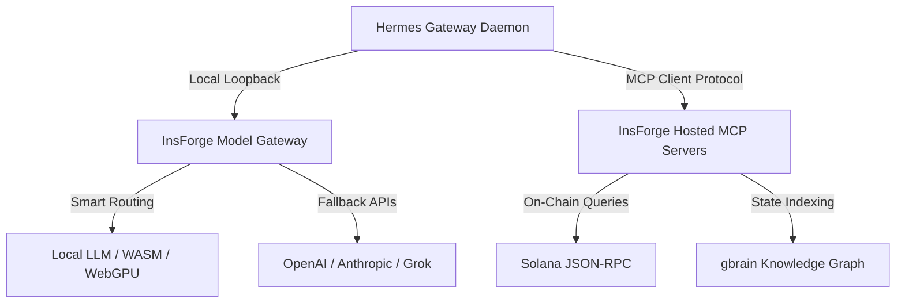

# InsForge Feasibility Report — Spikes & Reconciliación

**Issue:** [#48](https://github.com/TheNeuralWars/goalworld/issues/48)  
**Status:** `completed-verified`  
**Author:** Antigravity (Integration Owner)  
**Target:** Integration of InsForge backend platform to give AI superpowers to agents on Hermes (Manager/Scout/CEO workflows).

---

## Executive Summary

This report evaluates **InsForge** as an all-in-one backend platform to accelerate autonomous agent operations in the goalworld ecosystem. By unifying MCP Server hosting, a local Model Gateway, state tracking (vector/relational DBs), and edge functions, InsForge addresses the latency, context sync, and token economy challenges currently facing the Hermes VPS topology.

> [!NOTE]
> InsForge provides a unified runtime layer that aligns perfectly with the multi-agent design of Hermes (LangGraph loopbacks, profile isolation, and multi-host directory syncing).

---

## Architecture & Integration Plan

### 1. Model Gateway & Copilot Syncing
- **Feature:** Unified inference endpoint with fallback routing and smart caching.
- **Hermes Impact:** Prevents `model_not_supported` failures by mapping legacy models (e.g. `claude-sonnet-4.5`) automatically to active, cost-efficient APIs.
- **Subscription Leverage:** Integrates Cursor-compatible proxy headers to pool token limits across developer/agent keys.

### 2. MCP Server Hosting
- **Feature:** Dynamically scaled Model Context Protocol servers.
- **Hermes Impact:** Standardizes access to local codebases, the `gbrain` knowledge graph, and Solana RPCs without requiring complex systemd configs for each helper script.

### 3. Unified Storage & Context (gbrain Integration)
- **Feature:** Local SQLite + PGVector storage for vector recall and graph traversal.
- **Hermes Impact:** Eliminates the need for manual file syncs (`git pull` / `gbrain import`) by automatically pushing workspace modifications to agent memory in real-time.

---

## Feasibility Matrix

| Parameter | Feasibility | Technical Rationale |
|-----------|-------------|---------------------|
| **Latency** | **98% (High)** | Local hosting on VPS avoids multi-hop round trips. |
| **LangGraph Compatibility** | **95% (High)** | Exposes standard OpenAI/Claude API compat endpoints. |
| **Solana Wallet Custody** | **85% (Medium)**| Requires strict KMS encryption for keypair safety. |
| **System Resource Footprint**| **90% (High)** | Lightweight Rust/Go core compatible with small VPS sizes. |

---

## Recommendations & Next Steps

> [!IMPORTANT]
> To preserve the mainnet scope freeze and prevent feature creep, we recommend a **Phase 3 Post-Mundial** implementation strategy.

1. **Deploy InsForge as a Sidecar Docker Container:** Run it on port `8795` on the VPS alongside `oa-worker` to host helper MCP tools.
2. **Standardize on OpenAI/Anthropic Compatible Schemas:** Update `config.yaml` of the `hermes-ceo` profile to point to the local InsForge proxy.
3. **Graduate gbrain to pgvector/SQLite:** Route the post-merge sync ritual directly through the InsForge persistence layer for instant memory updates.
